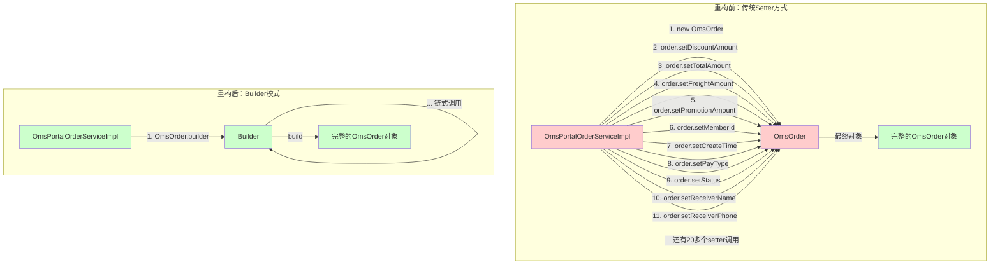
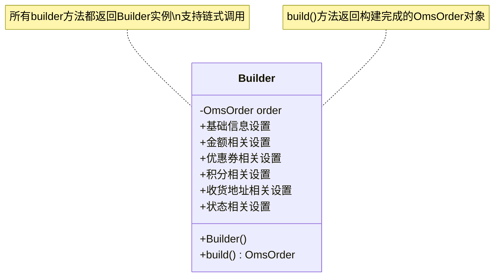
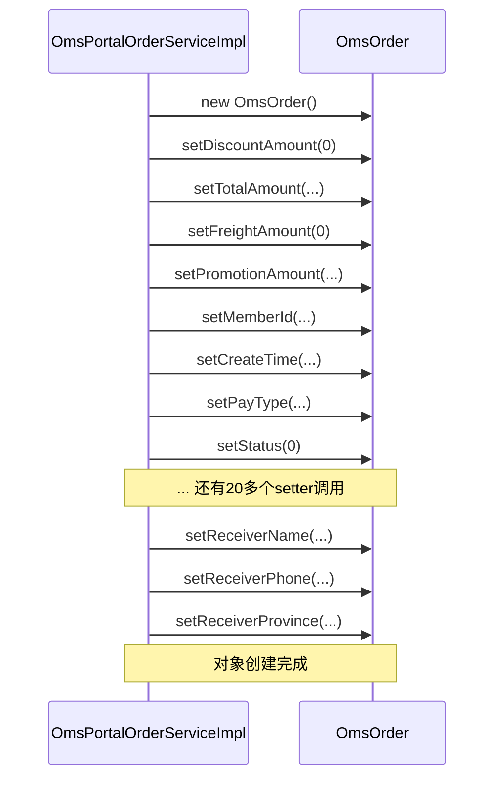
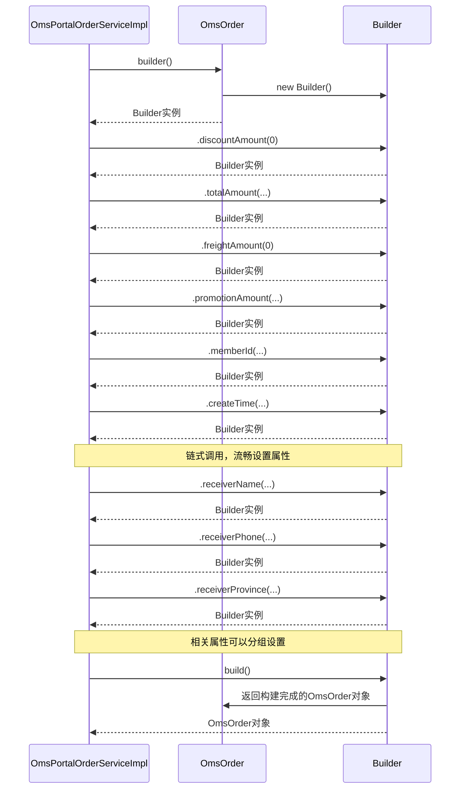

# Builder模式重构类图对比

本文档通过类图详细展示订单创建逻辑在应用Builder模式重构前后的结构对比。

## 一、重构前类图

```mermaid
classDiagram
    class OmsOrder {
        -Long id
        -Long memberId
        -Long couponId
        -String orderSn
        -Date createTime
        -String memberUsername
        -BigDecimal totalAmount
        -BigDecimal payAmount
        -BigDecimal freightAmount
        -BigDecimal promotionAmount
        -BigDecimal integrationAmount
        -BigDecimal couponAmount
        -BigDecimal discountAmount
        -Integer payType
        -Integer sourceType
        -Integer status
        -Integer orderType
        -String receiverName
        -String receiverPhone
        -String receiverProvince
        -String receiverCity
        -String receiverRegion
        -String receiverDetailAddress
        -Integer confirmStatus
        -Integer deleteStatus
        -Integer useIntegration
        -Integer integration
        -Integer growth
        +getId() Long
        +setId(Long) void
        +getMemberId() Long
        +setMemberId(Long) void
        +getCouponId() Long
        +setCouponId(Long) void
        +getOrderSn() String
        +setOrderSn(String) void
        +getCreateTime() Date
        +setCreateTime(Date) void
        +getMemberUsername() String
        +setMemberUsername(String) void
        +getTotalAmount() BigDecimal
        +setTotalAmount(BigDecimal) void
        +getPayAmount() BigDecimal
        +setPayAmount(BigDecimal) void
        +getFreightAmount() BigDecimal
        +setFreightAmount(BigDecimal) void
        +getPromotionAmount() BigDecimal
        +setPromotionAmount(BigDecimal) void
        +getIntegrationAmount() BigDecimal
        +setIntegrationAmount(BigDecimal) void
        +getCouponAmount() BigDecimal
        +setCouponAmount(BigDecimal) void
        +getDiscountAmount() BigDecimal
        +setDiscountAmount(BigDecimal) void
        +getPayType() Integer
        +setPayType(Integer) void
        +getSourceType() Integer
        +setSourceType(Integer) void
        +getStatus() Integer
        +setStatus(Integer) void
        +getOrderType() Integer
        +setOrderType(Integer) void
        +getReceiverName() String
        +setReceiverName(String) void
        +getReceiverPhone() String
        +setReceiverPhone(String) void
        +getReceiverProvince() String
        +setReceiverProvince(String) void
        +getReceiverCity() String
        +setReceiverCity(String) void
        +getReceiverRegion() String
        +setReceiverRegion(String) void
        +getReceiverDetailAddress() String
        +setReceiverDetailAddress(String) void
        +getConfirmStatus() Integer
        +setConfirmStatus(Integer) void
        +getDeleteStatus() Integer
        +setDeleteStatus(Integer) void
        +getUseIntegration() Integer
        +setUseIntegration(Integer) void
        +getIntegration() Integer
        +setIntegration(Integer) void
        +getGrowth() Integer
        +setGrowth(Integer) void
    }

    class OmsOrderItem {
        -Long id
        -Long orderId
        -String orderSn
        -Long productId
        -String productName
        -BigDecimal productPrice
        -Integer productQuantity
        +getId() Long
        +setId(Long) void
        +getOrderId() Long
        +setOrderId(Long) void
        +getOrderSn() String
        +setOrderSn(String) void
        +getProductId() Long
        +setProductId(Long) void
        +getProductName() String
        +setProductName(String) void
        +getProductPrice() BigDecimal
        +setProductPrice(BigDecimal) void
        +getProductQuantity() Integer
        +setProductQuantity(Integer) void
    }

    class OmsPortalOrderServiceImpl {
        -OmsOrderMapper orderMapper
        -OmsOrderItemMapper orderItemMapper
        -UmsMemberService memberService
        -OmsCartItemService cartItemService
        -UmsMemberReceiveAddressService memberReceiveAddressService
        +generateOrder(OrderParam) Map~String,Object~
        -calcTotalAmount(List~OmsOrderItem~) BigDecimal
        -calcPromotionAmount(List~OmsOrderItem~) BigDecimal
        -calcCouponAmount(List~OmsOrderItem~) BigDecimal
        -calcIntegrationAmount(List~OmsOrderItem~) BigDecimal
        -calcPayAmount(OmsOrder) BigDecimal
        -generateOrderSn(OmsOrder) String
    }

    class OrderParam {
        -List~Long~ cartIds
        -Long memberReceiveAddressId
        -Long couponId
        -Integer useIntegration
        -Integer payType
    }

    OmsPortalOrderServiceImpl ..> OmsOrder : creates
    OmsPortalOrderServiceImpl ..> OmsOrderItem : creates
    OmsPortalOrderServiceImpl ..> OrderParam : uses
    OmsOrder "1" *-- "many" OmsOrderItem : contains
```



### 重构前代码结构说明

**特点**：
1. `OmsOrder` 类只包含传统的 getter/setter 方法
2. `OmsPortalOrderServiceImpl.generateOrder()` 方法中通过大量独立的 `setter` 调用创建订单对象
3. 属性设置没有逻辑分组，代码冗长且难以阅读
4. 对象创建过程分散，难以保证对象状态的一致性

**问题**：
- 代码可读性差：大量重复的 `order.setXxx()` 调用
- 属性设置顺序混乱：相关属性被分散设置
- 维护困难：添加新属性需要在多处修改代码

## 二、重构后类图

```mermaid
classDiagram
    class OmsOrder {
        -Long id
        -Long memberId
        -Long couponId
        -String orderSn
        -Date createTime
        -String memberUsername
        -BigDecimal totalAmount
        -BigDecimal payAmount
        -BigDecimal freightAmount
        -BigDecimal promotionAmount
        -BigDecimal integrationAmount
        -BigDecimal couponAmount
        -BigDecimal discountAmount
        -Integer payType
        -Integer sourceType
        -Integer status
        -Integer orderType
        -String receiverName
        -String receiverPhone
        -String receiverProvince
        -String receiverCity
        -String receiverRegion
        -String receiverDetailAddress
        -Integer confirmStatus
        -Integer deleteStatus
        -Integer useIntegration
        -Integer integration
        -Integer growth
        +getId() Long
        +setId(Long) void
        +getMemberId() Long
        +setMemberId(Long) void
        +builder()$ Builder
    }

    class Builder {
        -OmsOrder order
        +Builder()
        +id(Long) Builder
        +memberId(Long) Builder
        +couponId(Long) Builder
        +orderSn(String) Builder
        +createTime(Date) Builder
        +memberUsername(String) Builder
        +totalAmount(BigDecimal) Builder
        +payAmount(BigDecimal) Builder
        +freightAmount(BigDecimal) Builder
        +promotionAmount(BigDecimal) Builder
        +integrationAmount(BigDecimal) Builder
        +couponAmount(BigDecimal) Builder
        +discountAmount(BigDecimal) Builder
        +payType(Integer) Builder
        +sourceType(Integer) Builder
        +status(Integer) Builder
        +orderType(Integer) Builder
        +receiverName(String) Builder
        +receiverPhone(String) Builder
        +receiverProvince(String) Builder
        +receiverCity(String) Builder
        +receiverRegion(String) Builder
        +receiverDetailAddress(String) Builder
        +confirmStatus(Integer) Builder
        +deleteStatus(Integer) Builder
        +useIntegration(Integer) Builder
        +integration(Integer) Builder
        +growth(Integer) Builder
        +build() OmsOrder
    }

    class OmsOrderItem {
        -Long id
        -Long orderId
        -String orderSn
        -Long productId
        -String productName
        -BigDecimal productPrice
        -Integer productQuantity
        +getId() Long
        +setId(Long) void
        +getOrderId() Long
        +setOrderId(Long) void
        +getOrderSn() String
        +setOrderSn(String) void
        +getProductId() Long
        +setProductId(Long) void
        +getProductName() String
        +setProductName(String) void
        +getProductPrice() BigDecimal
        +setProductPrice(BigDecimal) void
        +getProductQuantity() Integer
        +setProductQuantity(Integer) void
    }

    class OmsPortalOrderServiceImpl {
        -OmsOrderMapper orderMapper
        -OmsOrderItemMapper orderItemMapper
        -UmsMemberService memberService
        -OmsCartItemService cartItemService
        -UmsMemberReceiveAddressService memberReceiveAddressService
        +generateOrder(OrderParam) Map~String,Object~
        +processOrderCreate(OrderCreateMessage) void
        -calcTotalAmount(List~OmsOrderItem~) BigDecimal
        -calcPromotionAmount(List~OmsOrderItem~) BigDecimal
        -calcCouponAmount(List~OmsOrderItem~) BigDecimal
        -calcIntegrationAmount(List~OmsOrderItem~) BigDecimal
        -calcPayAmount(OmsOrder) BigDecimal
        -generateOrderSn(OmsOrder) String
    }

    class OrderParam {
        -List~Long~ cartIds
        -Long memberReceiveAddressId
        -Long couponId
        -Integer useIntegration
        -Integer payType
    }

    class OrderCreateMessage {
        -String requestId
        -Long memberId
        -Long memberReceiveAddressId
        -Long couponId
        -Integer useIntegration
        -Integer payType
        -List~Long~ cartIds
        -Long createTime
    }

    OmsOrder +-- Builder : contains
    OmsPortalOrderServiceImpl ..> Builder : uses
    OmsPortalOrderServiceImpl ..> OmsOrder : creates via Builder
    OmsPortalOrderServiceImpl ..> OmsOrderItem : creates
    OmsPortalOrderServiceImpl ..> OrderParam : uses
    OmsPortalOrderServiceImpl ..> OrderCreateMessage : uses
    OmsOrder "1" *-- "many" OmsOrderItem : contains
```

### 重构后代码结构说明

**特点**：
1. `OmsOrder` 类新增静态方法 `builder()` 用于创建 Builder 实例
2. `OmsOrder` 内部包含静态内部类 `Builder`，提供链式调用的构建方法
3. `Builder` 类为每个属性提供对应的 `builder` 方法，所有方法返回 `Builder` 实例本身
4. `Builder.build()` 方法返回构建完成的 `OmsOrder` 对象
5. `OmsPortalOrderServiceImpl` 使用 Builder 模式链式调用创建订单对象

**优势**：
- 代码可读性高：链式调用使得代码流畅易读
- 逻辑分组清晰：相关属性可以组织在一起设置
- 维护容易：添加新属性只需在 Builder 中添加方法
- 对象构建过程清晰：整个构建过程一目了然

## 三、重构前后对比类图



## 四、Builder模式详细设计

### 4.1 Builder类结构



### 4.2 使用流程对比

#### 重构前使用流程



#### 重构后使用流程



## 五、代码示例对比

### 5.1 重构前代码示例

```java
// 重构前：大量独立的setter调用
OmsOrder order = new OmsOrder();
order.setDiscountAmount(new BigDecimal(0));
order.setTotalAmount(calcTotalAmount(orderItemList));
order.setFreightAmount(new BigDecimal(0));
order.setPromotionAmount(calcPromotionAmount(orderItemList));
order.setPromotionInfo(getOrderPromotionInfo(orderItemList));
if (orderParam.getCouponId() == null) {
    order.setCouponAmount(new BigDecimal(0));
} else {
    order.setCouponId(orderParam.getCouponId());
    order.setCouponAmount(calcCouponAmount(orderItemList));
}
if (orderParam.getUseIntegration() == null) {
    order.setIntegration(0);
    order.setIntegrationAmount(new BigDecimal(0));
} else {
    order.setIntegration(orderParam.getUseIntegration());
    order.setIntegrationAmount(calcIntegrationAmount(orderItemList));
}
order.setPayAmount(calcPayAmount(order));
order.setMemberId(currentMember.getId());
order.setCreateTime(new Date());
order.setMemberUsername(currentMember.getUsername());
order.setPayType(orderParam.getPayType());
order.setSourceType(1);
order.setStatus(0);
order.setOrderType(0);
// ... 还有更多setter调用
```

### 5.2 重构后代码示例

```java
// 重构后：链式调用，逻辑清晰
OmsOrder.Builder orderBuilder = OmsOrder.builder()
        // 基础金额信息
        .discountAmount(new BigDecimal(0))
        .totalAmount(calcTotalAmount(orderItemList))
        .freightAmount(new BigDecimal(0))
        .promotionAmount(calcPromotionAmount(orderItemList))
        .promotionInfo(getOrderPromotionInfo(orderItemList))
        // 用户信息
        .memberId(currentMember.getId())
        .createTime(new Date())
        .memberUsername(currentMember.getUsername())
        // 订单状态信息
        .payType(message.getPayType())
        .sourceType(1)
        .status(0)
        .orderType(0)
        .confirmStatus(0)
        .deleteStatus(0);

// 优惠券信息（条件设置，逻辑分组）
if (message.getCouponId() == null) {
    orderBuilder.couponAmount(new BigDecimal(0));
} else {
    orderBuilder.couponId(message.getCouponId())
            .couponAmount(calcCouponAmount(orderItemList));
}

// 积分信息（条件设置，逻辑分组）
if (message.getUseIntegration() == null) {
    orderBuilder.integration(0)
            .integrationAmount(new BigDecimal(0));
} else {
    orderBuilder.useIntegration(message.getUseIntegration())
            .integrationAmount(calcIntegrationAmount(orderItemList));
}

// 收货地址信息（逻辑分组）
UmsMemberReceiveAddress address = memberReceiveAddressService.getItem(message.getMemberReceiveAddressId());
orderBuilder.receiverName(address.getName())
        .receiverPhone(address.getPhoneNumber())
        .receiverPostCode(address.getPostCode())
        .receiverProvince(address.getProvince())
        .receiverCity(address.getCity())
        .receiverRegion(address.getRegion())
        .receiverDetailAddress(address.getDetailAddress());

// 构建订单对象
OmsOrder order = orderBuilder.build();
order.setPayAmount(calcPayAmount(order));
```

## 六、总结

通过类图对比可以看出：

1. **结构变化**：
   - 重构前：`OmsOrder` 类只包含传统的 getter/setter 方法
   - 重构后：`OmsOrder` 类新增 `Builder` 内部类和 `builder()` 静态方法

2. **使用方式变化**：
   - 重构前：通过大量独立的 `setter` 调用创建对象
   - 重构后：通过 `Builder` 链式调用创建对象

3. **代码质量提升**：
   - 可读性：链式调用使得代码更加流畅易读
   - 维护性：逻辑分组使得代码结构更清晰
   - 扩展性：添加新属性更容易

4. **设计模式应用**：
   - 成功应用了 Builder 模式
   - 符合创建复杂对象的最佳实践
   - 提高了代码的整体质量


