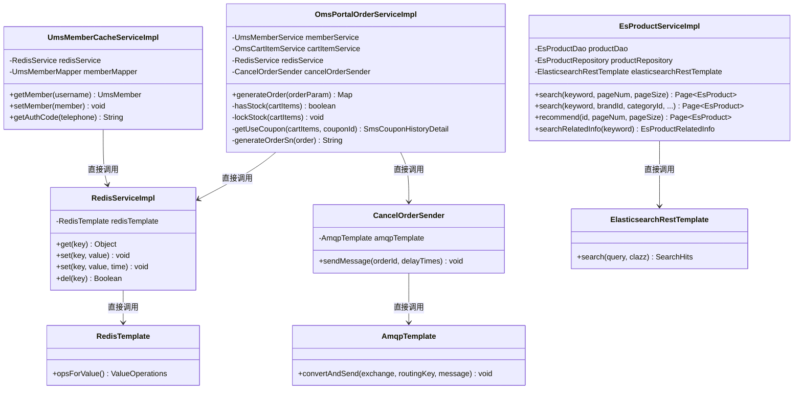
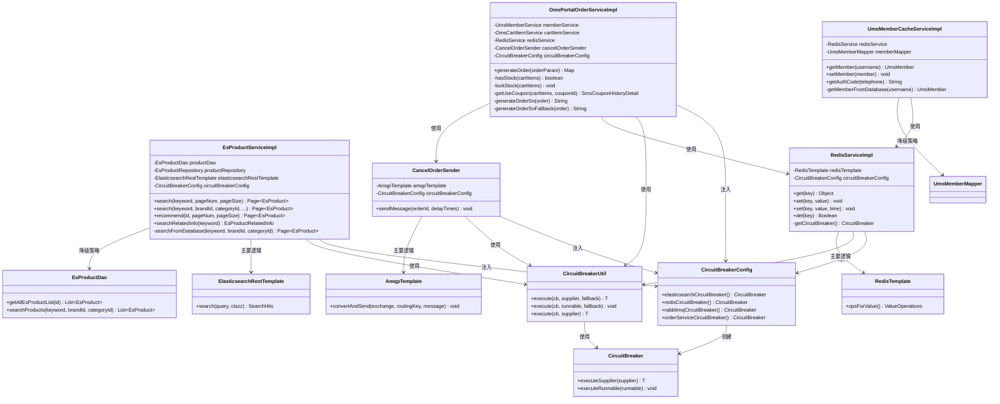

# 断路器模式重构 - 类图对比

## 一、重构前类图



## 二、重构后类图



## 三、详细对比说明

### 3.1 新增类

#### CircuitBreakerConfig
- **职责**：配置和管理所有断路器实例
- **方法**：
  - `elasticsearchCircuitBreaker()`: 创建 Elasticsearch 断路器
  - `redisCircuitBreaker()`: 创建 Redis 断路器
  - `rabbitmqCircuitBreaker()`: 创建 RabbitMQ 断路器
  - `orderServiceCircuitBreaker()`: 创建订单服务断路器

#### CircuitBreakerUtil
- **职责**：提供统一的断路器执行工具方法
- **方法**：
  - `execute(CircuitBreaker, Supplier, Supplier)`: 带降级策略的执行
  - `execute(CircuitBreaker, Runnable, Runnable)`: 无返回值带降级策略的执行
  - `execute(CircuitBreaker, Supplier)`: 无降级策略的执行

### 3.2 修改的类

#### EsProductServiceImpl
- **新增依赖**：`CircuitBreakerConfig circuitBreakerConfig`
- **修改方法**：
  - `search()`: 添加断路器保护，降级到数据库查询
  - `recommend()`: 添加断路器保护，降级到数据库查询
  - `searchRelatedInfo()`: 添加断路器保护，返回空结果

#### RedisServiceImpl
- **新增依赖**：`CircuitBreakerConfig circuitBreakerConfig`
- **新增方法**：`getCircuitBreaker()`: 获取 Redis 断路器
- **修改方法**：
  - `get()`: 添加断路器保护，失败返回 null
  - `set()`: 添加断路器保护，失败记录日志
  - `del()`: 添加断路器保护，失败返回 false

#### UmsMemberCacheServiceImpl
- **修改方法**：
  - `getMember()`: 添加降级逻辑，Redis 不可用时从数据库查询

#### OmsPortalOrderServiceImpl
- **新增依赖**：`CircuitBreakerConfig circuitBreakerConfig`
- **修改方法**：
  - `generateOrder()`: 为关键步骤添加断路器保护
    - 库存检查：添加断路器保护
    - 优惠券验证：添加断路器保护
    - 库存锁定：添加断路器保护
    - 订单号生成：添加 Redis 断路器保护
    - 消息发送：添加 RabbitMQ 断路器保护

#### CancelOrderSender
- **新增依赖**：`CircuitBreakerConfig circuitBreakerConfig`
- **修改方法**：
  - `sendMessage()`: 添加 RabbitMQ 断路器保护，失败记录日志

### 3.3 扩展的类

#### EsProductDao
- **新增方法**：`searchProducts()`: 从数据库搜索商品（降级策略使用）

## 四、执行流程对比

### 4.1 重构前：搜索服务执行流程

```
用户请求搜索
  ↓
EsProductServiceImpl.search()
  ↓
ElasticsearchRestTemplate.search()  [如果失败，抛出异常]
  ↓
返回结果（或异常）
```

### 4.2 重构后：搜索服务执行流程

```
用户请求搜索
  ↓
EsProductServiceImpl.search()
  ↓
CircuitBreakerUtil.execute()
  ↓
检查断路器状态
  ├─ 关闭状态 → 执行主要逻辑
  │   ├─ 成功 → 返回结果
  │   └─ 失败 → 记录失败，执行降级策略
  ├─ 打开状态 → 直接执行降级策略
  └─ 半开状态 → 尝试执行主要逻辑
      ├─ 成功 → 关闭断路器，返回结果
      └─ 失败 → 打开断路器，执行降级策略
  ↓
降级策略：EsProductDao.searchProducts()
  ↓
返回结果
```

### 4.3 重构前：订单生成流程

```
用户提交订单
  ↓
OmsPortalOrderServiceImpl.generateOrder()
  ↓
检查库存 [如果失败，抛出异常]
  ↓
验证优惠券 [如果失败，抛出异常]
  ↓
锁定库存 [如果失败，抛出异常]
  ↓
生成订单号 [如果 Redis 失败，抛出异常]
  ↓
发送消息 [如果 RabbitMQ 失败，抛出异常]
  ↓
返回结果（或异常）
```

### 4.4 重构后：订单生成流程

```
用户提交订单
  ↓
OmsPortalOrderServiceImpl.generateOrder()
  ↓
检查库存（带断路器保护）
  ├─ 成功 → 继续
  └─ 失败 → 执行降级策略（返回 false，拒绝下单）
  ↓
验证优惠券（带断路器保护）
  ├─ 成功 → 继续
  └─ 失败 → 执行降级策略（返回 null，不使用优惠券）
  ↓
锁定库存（带断路器保护）
  ├─ 成功 → 继续
  └─ 失败 → 执行降级策略（抛出异常，订单生成失败）
  ↓
生成订单号（带 Redis 断路器保护）
  ├─ 成功 → 使用 Redis 生成
  └─ 失败 → 执行降级策略（使用时间戳+随机数）
  ↓
发送消息（带 RabbitMQ 断路器保护）
  ├─ 成功 → 发送消息
  └─ 失败 → 执行降级策略（记录日志）
  ↓
返回结果
```

## 五、依赖关系对比

### 5.1 重构前依赖关系

```
服务类 → 外部服务（直接依赖）
  - 无容错机制
  - 异常时直接抛出
  - 服务不可用
```

### 5.2 重构后依赖关系

```
服务类 → CircuitBreakerUtil → CircuitBreaker → 外部服务
  - 有容错机制
  - 异常时执行降级策略
  - 服务部分可用
```

## 六、关键设计模式

### 6.1 断路器模式（Circuit Breaker Pattern）
- **目的**：防止故障服务拖垮整个系统
- **实现**：通过 `CircuitBreaker` 控制对故障服务的调用

### 6.2 降级模式（Fallback Pattern）
- **目的**：在主要服务不可用时提供备用方案
- **实现**：通过 `CircuitBreakerUtil.execute()` 的第二个参数提供降级逻辑

### 6.3 策略模式（Strategy Pattern）
- **目的**：不同的服务使用不同的降级策略
- **实现**：每个服务定义自己的降级策略（Lambda 表达式）

### 6.4 模板方法模式（Template Method Pattern）
- **目的**：统一断路器执行流程
- **实现**：`CircuitBreakerUtil` 封装了统一的执行模板

## 七、类图总结

### 重构前特点
- 服务类直接依赖外部服务
- 无容错机制
- 异常时服务不可用

### 重构后特点
- 引入断路器配置和工具类
- 服务类通过工具类调用外部服务
- 有完整的容错和降级机制
- 异常时执行降级策略，服务部分可用

### 核心改进
1. **解耦**：服务类不再直接依赖外部服务，通过断路器间接调用
2. **容错**：添加断路器保护，防止故障传播
3. **降级**：提供降级策略，保证服务部分可用
4. **统一**：通过工具类统一处理断路器逻辑

