# 断路器模式重构 - 时序图对比

## 一、搜索服务 - 重构前后对比

### 1.1 重构前：正常流程

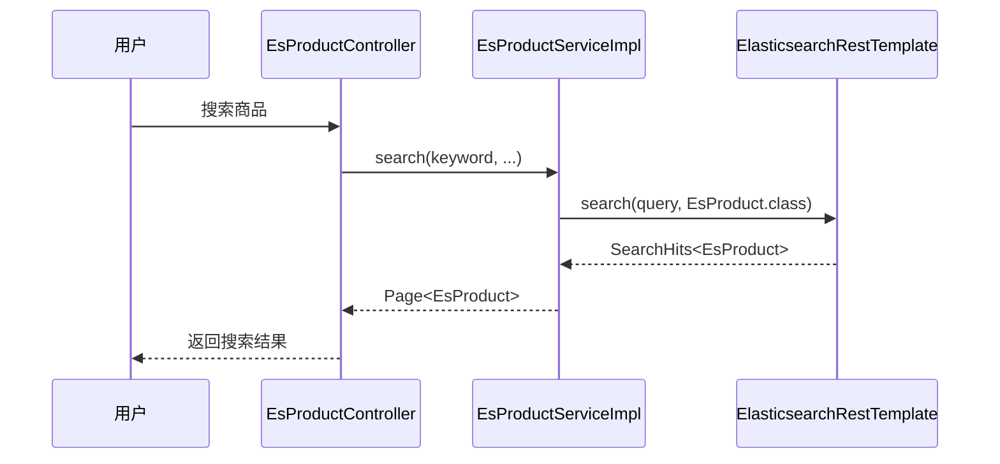

### 1.2 重构前：异常流程

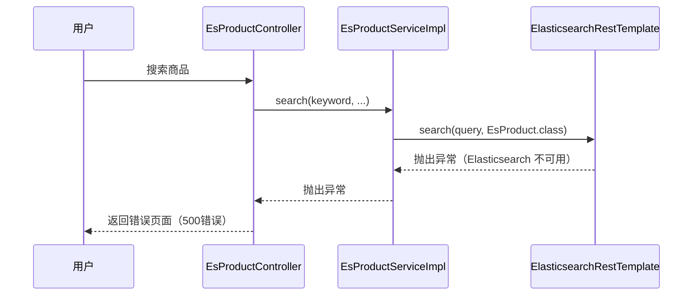

### 1.3 重构后：正常流程

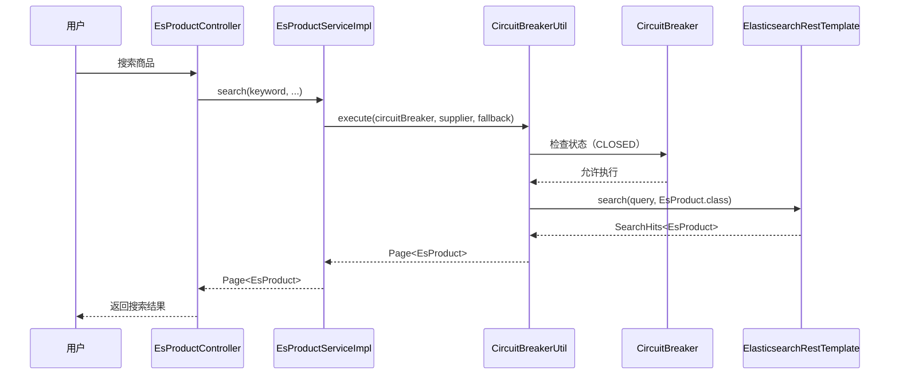

### 1.4 重构后：降级流程（断路器打开）

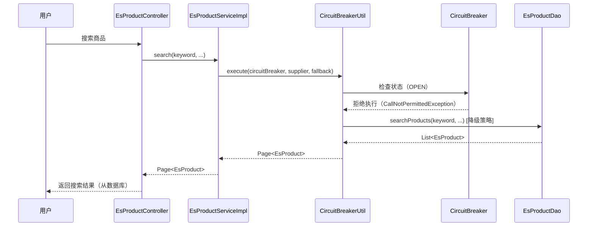

### 1.5 重构后：降级流程（执行失败）

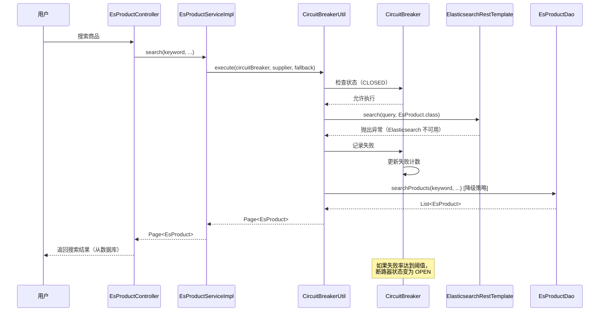

## 二、订单服务 - 重构前后对比

### 2.1 重构前：正常流程

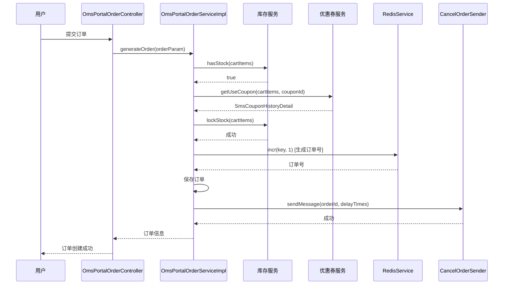

### 2.2 重构前：异常流程（库存检查失败）

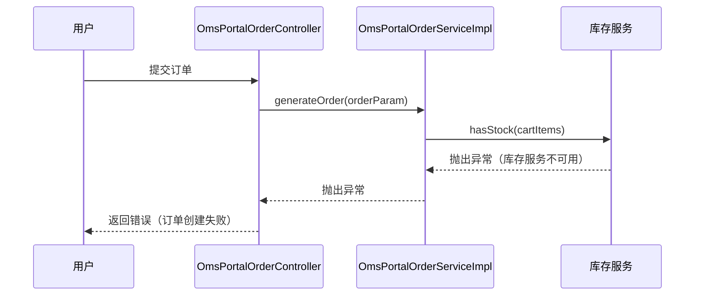

### 2.3 重构后：正常流程

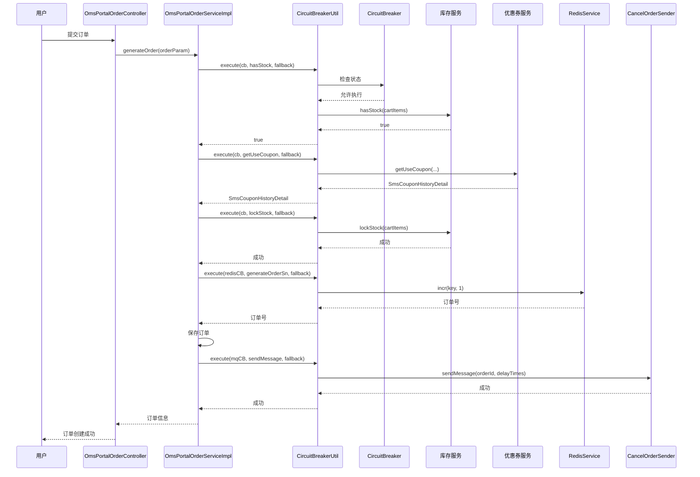

### 2.4 重构后：部分降级流程（优惠券服务故障）

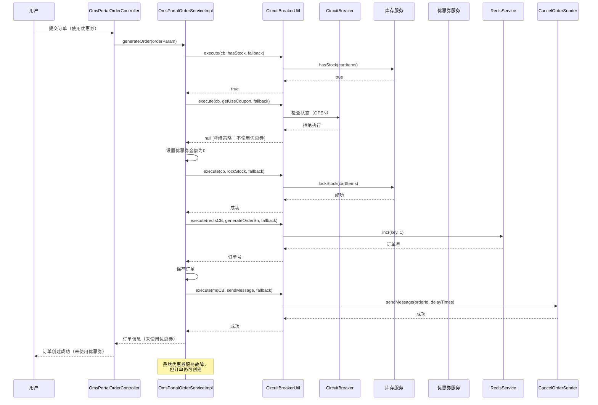

### 2.5 重构后：降级流程（Redis 故障）

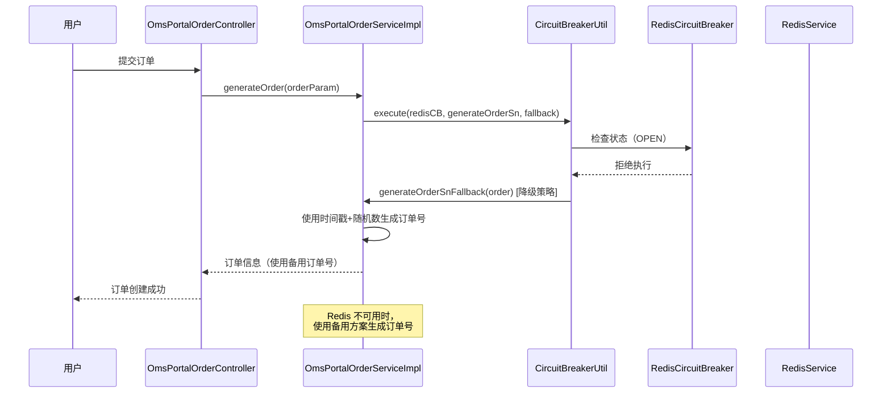

## 三、缓存服务 - 重构前后对比

### 3.1 重构前：正常流程

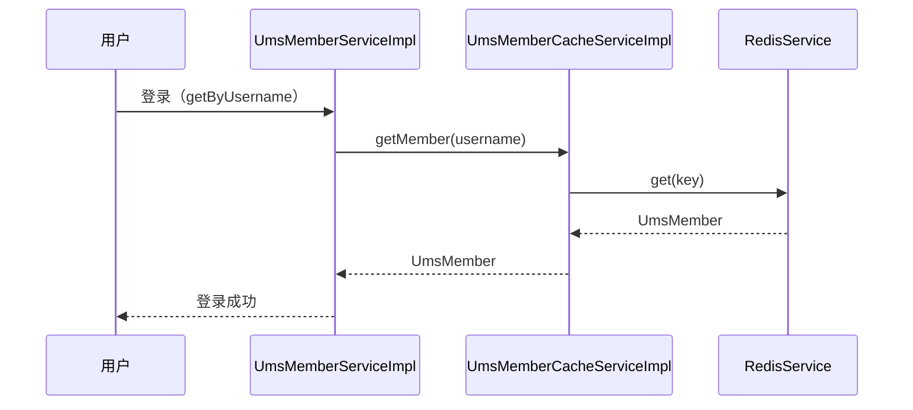

### 3.2 重构前：异常流程（Redis 故障）

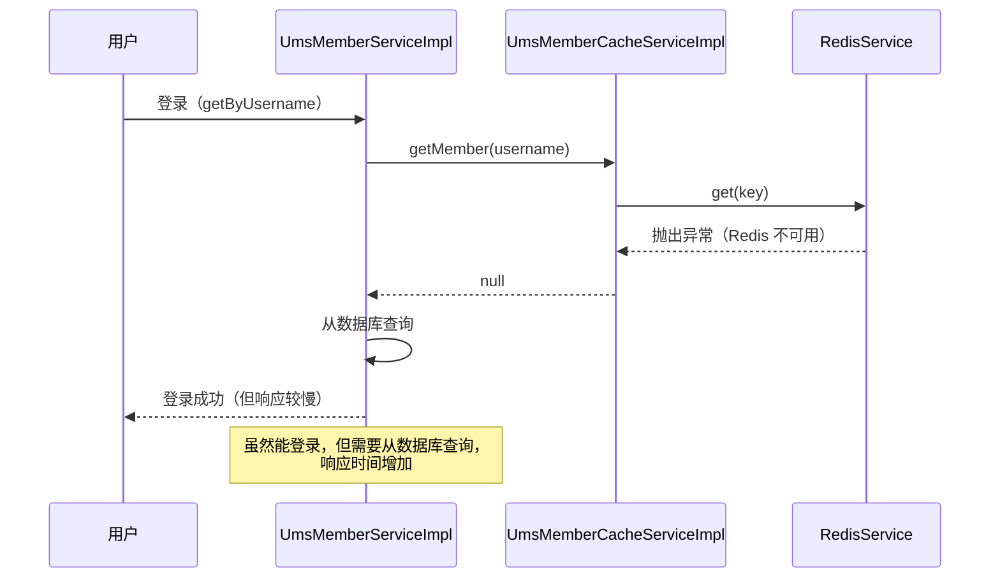

### 3.3 重构后：正常流程

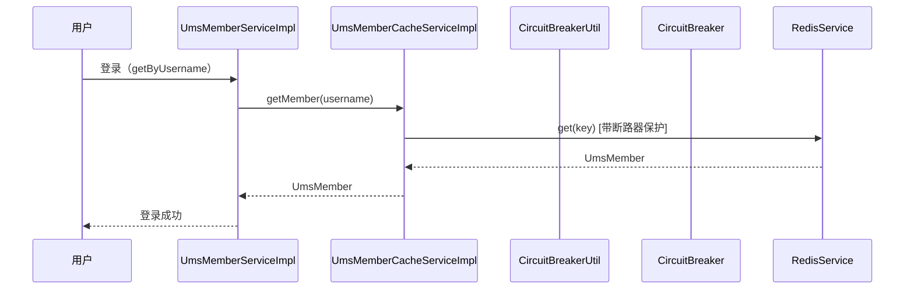

### 3.4 重构后：降级流程（Redis 故障）

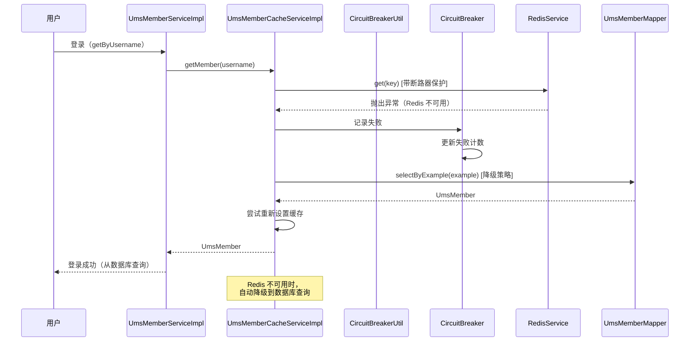

## 四、消息队列服务 - 重构前后对比

### 4.1 重构前：正常流程

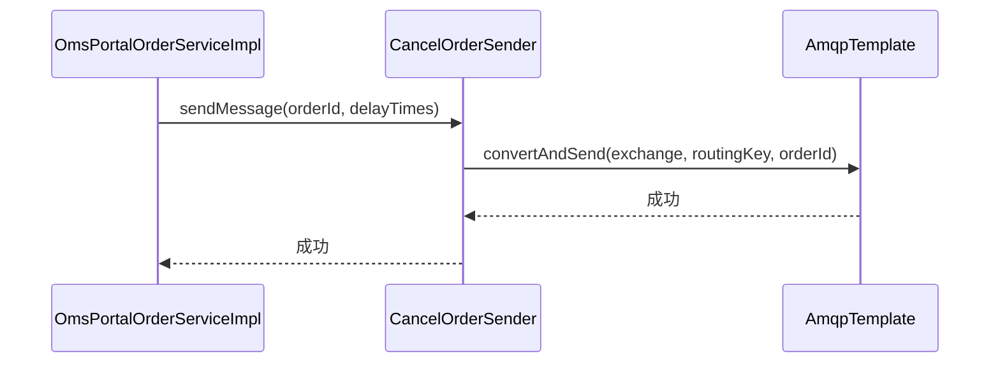

### 4.2 重构前：异常流程（RabbitMQ 故障）

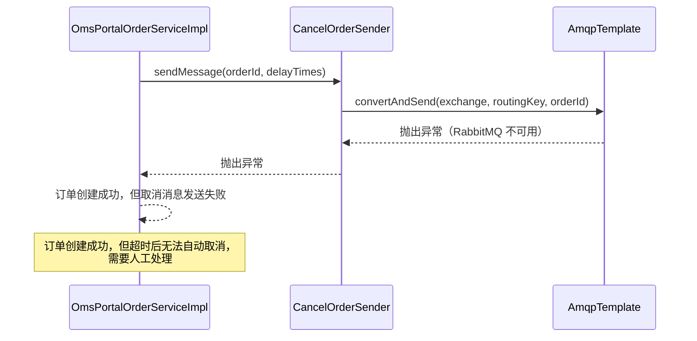

### 4.3 重构后：正常流程

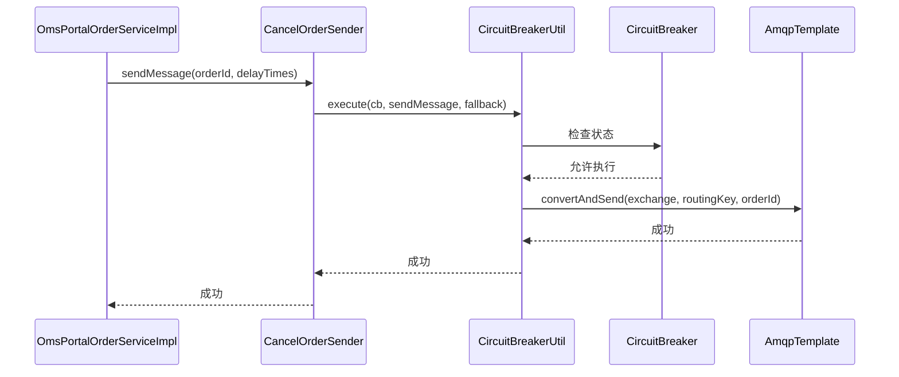

### 4.4 重构后：降级流程（RabbitMQ 故障）

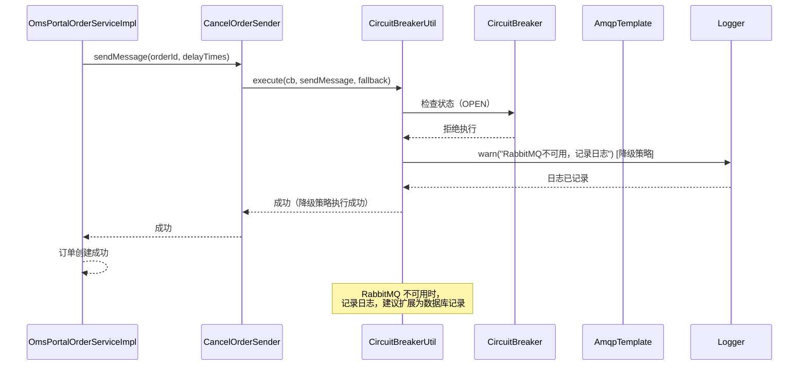

## 五、断路器状态转换

### 5.1 断路器状态转换流程

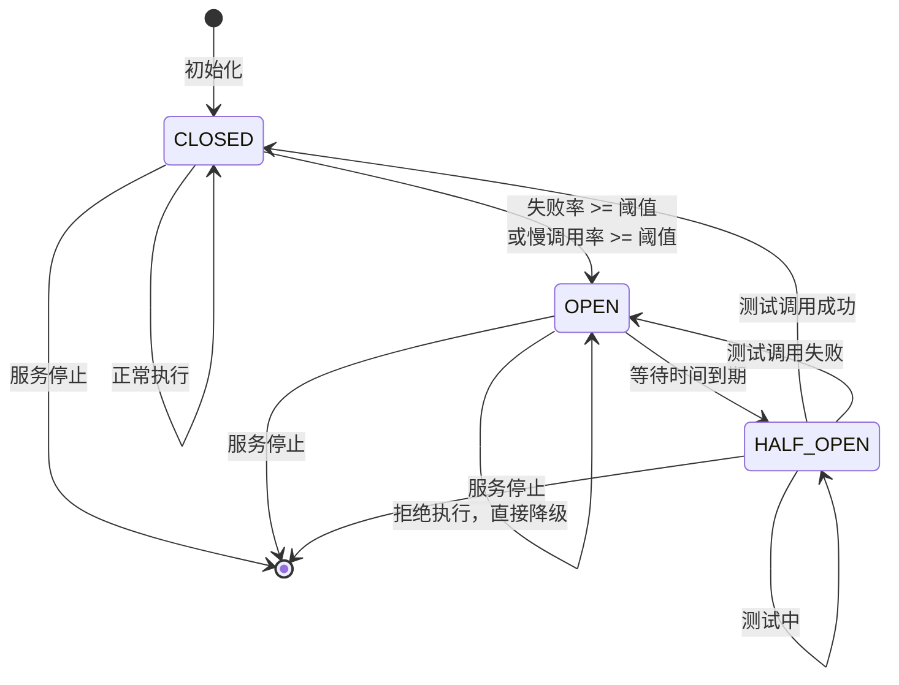

### 5.2 断路器状态说明

- **CLOSED（关闭）**：正常状态，允许执行
- **OPEN（打开）**：故障状态，拒绝执行，直接降级
- **HALF_OPEN（半开）**：测试状态，允许少量调用测试服务是否恢复

## 六、总结

### 重构前特点
- 直接调用外部服务
- 异常时抛出异常，服务不可用
- 无容错机制

### 重构后特点
- 通过断路器间接调用外部服务
- 异常时执行降级策略，服务部分可用
- 完整的容错和降级机制
- 自动状态转换和恢复

### 关键改进
1. **可用性提升**：从完全不可用到部分可用
2. **用户体验改善**：从错误页面到功能降级但可用
3. **自动恢复**：断路器自动检测服务恢复
4. **统一处理**：通过工具类统一处理断路器逻辑

