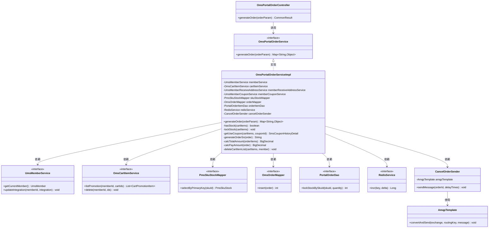
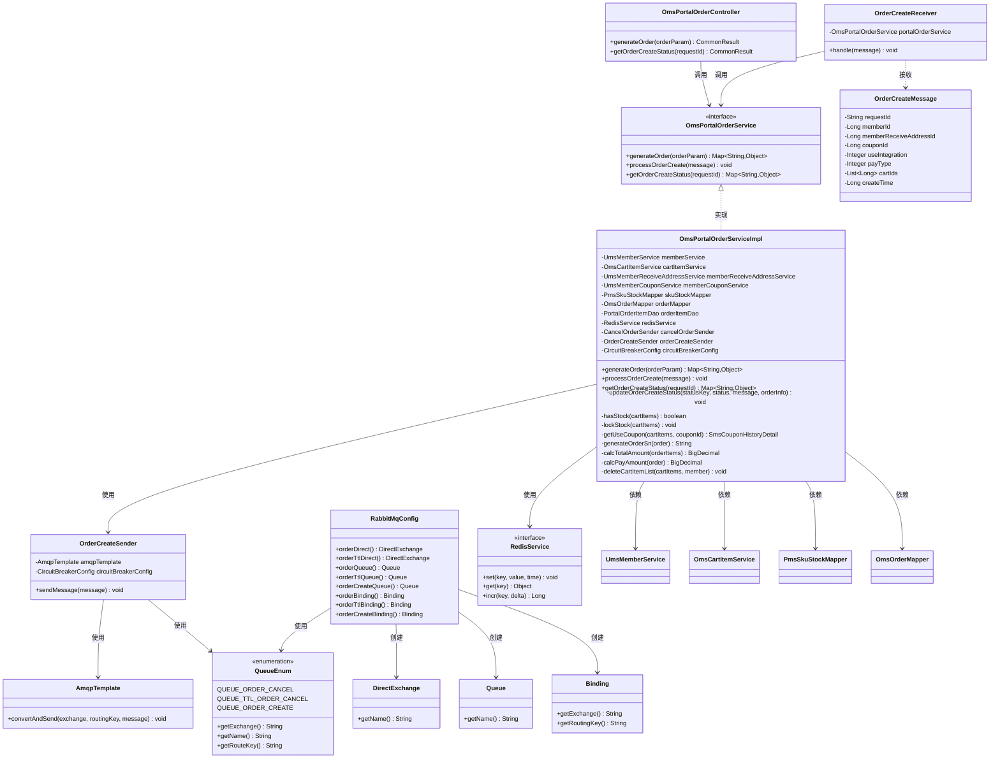
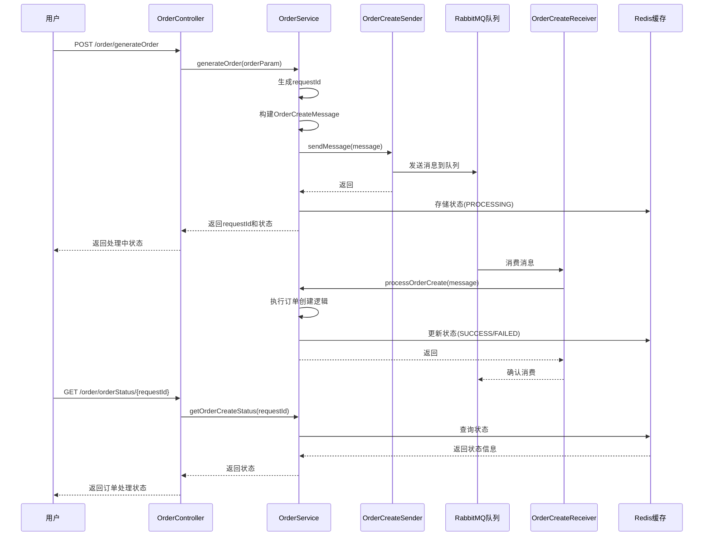

# 生产者-消费者模式重构 - 类图对比

## 一、重构前类图

### 重构前流程说明

1. **同步处理**：用户请求直接进入 `generateOrder()` 方法
2. **串行执行**：所有业务逻辑（库存检查、库存锁定、订单创建、优惠券扣减、积分扣减）在同一线程中串行执行
3. **阻塞等待**：用户必须等待所有操作完成才能得到响应
4. **资源竞争**：多个请求同时访问库存、优惠券、积分等资源，存在竞态条件
5. **无状态追踪**：无法实时查询订单处理状态

## 二、重构后类图

### 重构后流程说明

1. **异步处理**：用户请求进入 `generateOrder()` 方法后，立即构建消息并发送到队列，快速返回
2. **消息队列**：使用 RabbitMQ 作为消息中间件，实现生产者和消费者的解耦
3. **并行处理**：消费者从队列中获取消息，异步处理订单创建逻辑
4. **状态追踪**：使用 Redis 存储订单处理状态（PROCESSING、SUCCESS、FAILED）
5. **资源隔离**：通过消息队列缓冲，避免高并发时的直接资源竞争

## 三、核心类对比

### 3.1 新增类

| 类名 | 职责 | 位置 |
|------|------|------|
| `OrderCreateMessage` | 订单创建消息DTO，封装订单创建所需的所有信息 | `mall-portal/domain/` |
| `OrderCreateSender` | 订单创建消息生产者，负责发送消息到队列 | `mall-portal/component/` |
| `OrderCreateReceiver` | 订单创建消息消费者，负责处理订单创建逻辑 | `mall-portal/component/` |

### 3.2 修改类

| 类名 | 修改内容 | 说明 |
|------|----------|------|
| `OmsPortalOrderService` | 新增 `processOrderCreate()` 和 `getOrderCreateStatus()` 方法 | 接口扩展 |
| `OmsPortalOrderServiceImpl` | `generateOrder()` 改为异步模式，新增 `processOrderCreate()` 方法 | 核心逻辑重构 |
| `OmsPortalOrderController` | 新增 `getOrderCreateStatus()` 接口 | 新增状态查询接口 |
| `QueueEnum` | 新增 `QUEUE_ORDER_CREATE` 枚举 | 队列配置扩展 |
| `RabbitMqConfig` | 新增订单创建队列和绑定配置 | RabbitMQ配置扩展 |

## 四、设计模式应用

### 4.1 生产者-消费者模式

- **生产者**：`OrderCreateSender` 负责生产订单创建消息
- **消息队列**：RabbitMQ 作为消息中间件
- **消费者**：`OrderCreateReceiver` 负责消费消息并处理订单创建

### 4.2 异步处理模式

- **请求处理**：用户请求立即返回，不等待订单创建完成
- **后台处理**：订单创建在后台异步执行
- **状态查询**：通过 `requestId` 查询订单处理状态

### 4.3 状态模式

订单处理状态流转：
- `PROCESSING` → `SUCCESS`（成功）
- `PROCESSING` → `FAILED`（失败）

## 五、消息流转图

## 六、关键改进点

### 6.1 解耦

- **重构前**：订单创建逻辑与用户请求紧密耦合
- **重构后**：通过消息队列实现生产者和消费者的解耦

### 6.2 性能

- **重构前**：用户必须等待所有业务逻辑完成（通常需要几百毫秒到几秒）
- **重构后**：用户请求立即返回（通常只需要几十毫秒）

### 6.3 并发处理

- **重构前**：多个请求同时访问共享资源，存在竞态条件
- **重构后**：消息队列缓冲请求，消费者串行处理，避免资源竞争

### 6.4 可扩展性

- **重构前**：难以扩展新的订单处理逻辑
- **重构后**：可以轻松添加新的消费者处理其他业务（如库存扣减、优惠券扣减、积分扣减等）

### 6.5 可靠性

- **重构前**：订单创建失败，用户无法感知处理状态
- **重构后**：消息持久化确保订单不丢失，状态可追踪

